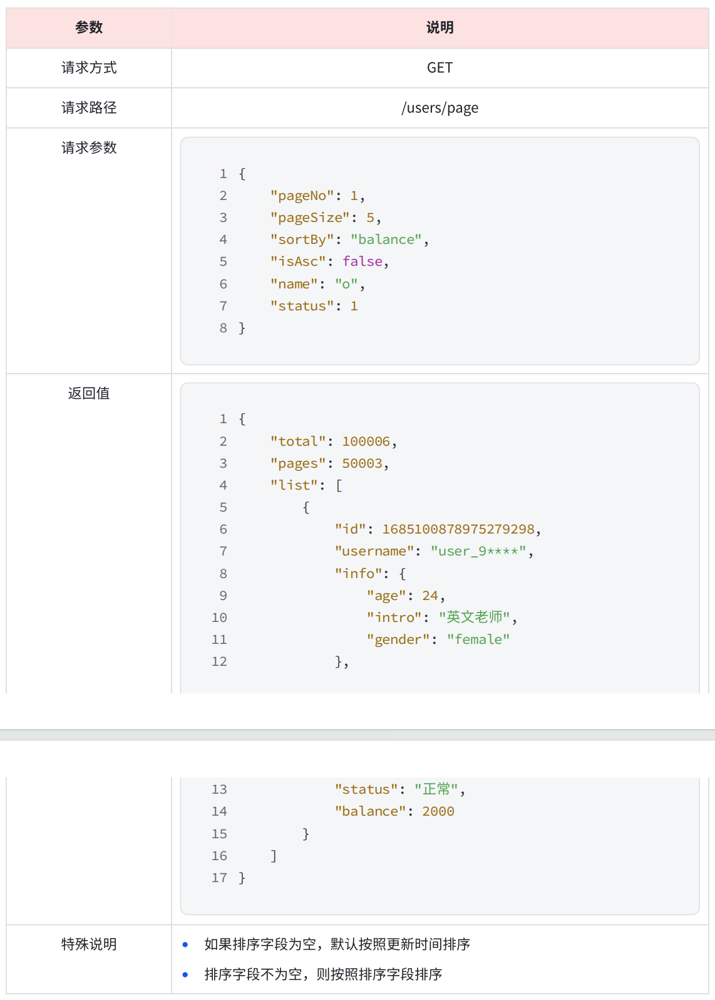
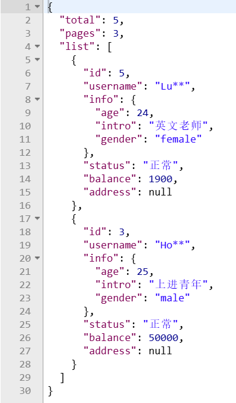
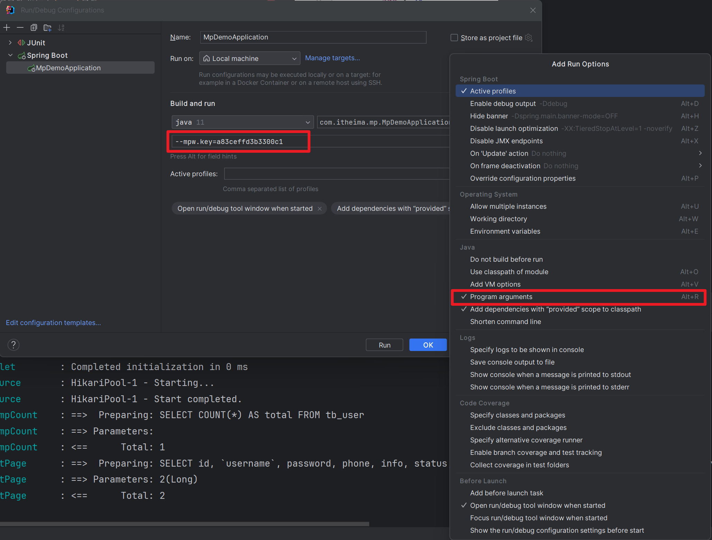

# MyBatis-Plus Demo
## 1. MyBatis-Plus的使用
在`src/main/java/com/itheima/mp/mapper/UserMapper.java`下，使类继承`BaseMapper<User>`，就可以使用常见的一些语句

测试见`src/test/java/com/itheima/mp/MpDemoApplicationTests.java`下的：
- `testInsert`
- `testSelectById`
- `testQueryByIds`
- `testUpdateById`
- `testDeleteUser`

## 2. MyBatis-Plus常用注解
见`src/main/java/com/itheima/mp/domain/po/User.java`实体类

这里使用了：
- `@TableName()`指定表名
- `@TableId()`指定Id类型的一些属性
- `@TableField()`指定对应字段名

## 3. MyBatis-Plus条件构造器
`src/test/java/com/itheima/mp/MpDemoApplicationTests.java`下演示了复杂的条件构造器模式：
- `testQueryWrapper`
- `testUpdateByQueryWrapper`
- `testUpdateWrapper`

这里只展示了非lambda形式。推荐使用lambda形式，将column修改为：
User::getId
User::getName
User::getInfo
User::getBalance
等等等等......

这样的好处是假如在日后更新了数据库字段名，就不需要修改具体语句中的内容，只需要使用`@TableField`改一下实体类的映射就可以

## 4. 自定义Sql
`src/test/java/com/itheima/mp/MpDemoApplicationTests.java`下演示了,即`testUpdateCustomSql`

需求：更新id为 1,2,4 的⽤⼾的余额，扣200

语句为：UPDATE user SET balance = balance - 200 WHERE id in (1, 2, 4)

假设`testUpdateWrapper`是业务层，不推荐将Sql语句写在业务层，而应该写在数据持久层，也就是Mapper中

通过Wrapper自定义条件，并将参数传入到自己自定义的语句中

在自己自定义的语句中通过`@Param("ew")`来指明wrapper对象（这个是固定的！），通过其他名字来指定传入的参数

## 4.1 自定义Sql用于多表查询

见`src/test/java/com/itheima/mp/MpDemoApplicationTests.java`下的`testQueryMultiTable`

我尝试使用LambdaQueryWrapper，但是好像并不好使，在定义：
```java
LambdaQueryWrapper<User> users = new LambdaQueryWrapper<User>
        .in(User::getId, List.of(1L, 2L, 4L))
        .eq(Address::getCity, "北京") // 这里会出问题，因为上面定义了类是User，这里好像找不到这个getCity方法
```

但是可以通过`.lambda`转换：
```java
LambdaQueryWrapper<User> userLambdaQueryWrapper = new QueryWrapper<User>()
        .in("u.id", ids)
        .eq("a.city", "北京")
        .lambda();
```

# 5. IService接口
## 5.1 IService接口的使用
在`src/main/java/com/itheima/mp/service/IUserService.java`接口下继承IService

在`src/main/java/com/itheima/mp/service/impl/UserServiceImpl.java`下继承ServiceImpl<UserMapper, User>，其中第一个类是Mapper类，第二个是对应的实体类，这个类里边实现了IService要求的许多方法，接着实现IUserService

测试CRUD见`src/test/java/com/itheima/mp/service/UserServiceTest.java`

## 5.2 IService做简单业务开发
在Controller做基础业务开发见`src/main/java/com/itheima/mp/controller/UserController.java`

## 5.3 IService做复杂业务开发
在Controller做复杂业务开发见`src/main/java/com/itheima/mp/controller/UserController.java`下的`deductBalance`

在这部分中主要就是在业务层对用户合法性进行校验，并对余额进行检查

对于Mapper中之前会使用的`${ew.customSqlSegment}`，简单的条件可以不使用wrapper来实现，复杂的条件比如`id in (ids)`这些需要使用一些循环来写的，才需要使用wrapper，简单的可以自己手写

在这个开发过程中，遇到的问题包括：
1. 请求参数如果是单个参数不可以使用`@RequestParam`，否则会报错无法解析条件的问题：`Required request parameter 'id' for method parameter type long is not presen...`
2. 使用swapper时记得将参数勾选上，如果勾选上提示`Request method 'PUT' not supported`的话，可以检查前后端的请求和规定链接是否一致

## 5.4 IService的Lambda方法
在`src/main/java/com/itheima/mp/controller/UserController.java`下的复杂条件查询方法`queryUsers`就使用了Lambda查询

同时在`src/main/java/com/itheima/mp/service/impl/UserServiceImpl.java`中的`deductMoney`也给出了更新余额的Lambda实现形式，
在这种实现形式中还使用了乐观锁来保证有多个线程访问同一个用户的方法时不会出现问题。

lambda适用于一些原本需要再Mapper.xml中写的一些判断语句，如：
```xml
<if test="name != null">
    AND userName LIKE #{name}
</if>
```

## 5.5 IService中的批量新增
做批量新增的三种方案：
1. 普通for循环逐条插入，速度很慢，不推荐（因为一条语句要发送一个网络请求）
2. MP的批量新增，基于预编译的批处理，性能不错（MP会将所有的插入请求打包起来，比如1000条打包一份，一次网络请求发送1000条插入语句）
3. 配置JDBC参数，开启rewriteBatchedStatements，性能最好（这会将所有的请求转换成一条Sql语句进行执行，效率最高）

对于第一种方案：
```java
void testsaveOneByone(){
    long b = system.currentTimeMillis();
    for(int i=1;i<=100000;i++){
        userService.save(buildUser(i));
    };
    long e = system.currentTimeMillis();
    System.out.println("耗时:"+(e- b));
}
```

对于第二种方案：
```java
    // 准备一个容量为1000的集合
    List<User> list = new ArrayList<>(1000);
    long b = system.currentTimeMillis();
    
    for (int i = 1; i <= 100000; i++){
        // 向集合中加入新用户
        list.add(builderUser(i));
        if (i % 1000 == 0){
            // 发送一次网络请求
            userService.saveBatch(list);
            // 清空集合
            list.clear();
        }
    }
    
    long e = system.currentTimeMillis();
    System.out.println("耗时:"+(e- b));
```

对于第三种方案：

在第二种方案的基础上只需要在`application.yml`后拼接一个参数：`rewriteBatchedStatements=True`即可。

# 6. DB静态工具
## 6.1 为什么需要DB静态工具？
思考一个场景：查询用户时，我们需要同时返回用户的地址信息

在这种情况下，我们可能还需要在`UserService`业务类中额外地加入如`AddressService`或者`AddressMapper`等`User`无关的内容，
假如说加入的是`AddressService`，未来`AddressService`又依赖于`UserService`，就会导致循环依赖的问题。

虽然Spring能够处理好循环依赖，但是我们应当尽量避免循环依赖的出现，这时候就需要使用DB静态工具

## 6.2 案例一：给定用户id，查询用户时同时查询用户地址
对应于`service/impl/UserServiceImpl.java`下的`queryUserAndAddressById`方法

步骤：
1. 给`UserVO`新建一个`List<AddressVO> addresses`属性，用于存放用户地址（因为这个属性只是面向输出的，我们不需要在po里面加，只需要在面向输出的实体中加即可）
2. 根据给定的用户id查询用户信息得到`User`类，可以使用`BeanUtil`转换为`UserVO`（面向输出的实体）
3. 根据`User`的id在`Address`表中查询对应地址，这时候就使用到DB静态工具类：`Db.lambdaQuery(Address.class).eq(Address::getUserId, id).list();`，在`lambdaQuery`中指定要查询的类，后面跟平时一样接一些等式（`Where`条件），`.list()`表示返回列表
4. 得到`Address`列表后，使用`BeanUtil`将列表转换为`AddressVO`，并将这个地址属性设置到`UserVO`中去
5. 返回`UserVO`

## 6.3 案例二：给定批量用户ids，查询这一些用户的信息及用户地址
对应于`service/impl/UserServiceImpl.java`下的`queryBatchUserAndAddressByIds`方法

步骤：
1. 根据`ids`查询用户信息得到列表`users`：`baseMapper.selectBatchIds(ids)`，将`users`使用`BeanUtil`转换为`userVOs`
2. ！注意条件的判断，此处使用了一个判空，假如用户列表为空的话，直接返回空
3. 将`users`的`ids`批量提取出来得到`userIds`，这里使用到了`collections`的方法：`users.stream().map(User::getId).collect(Collectors.toList());`
4. 使用`in`语句在`Address`表中批量查询用户的地址信息，并使用`BeanUril`转换得到地址列表`addressVOList`
5. `addressVOList`的结果不利于我们将信息设置到对应的用户里去，如果能够转成`userId`为K，`addresses`为V的HashMap是最好的，所以再次使用`collections`方法：`addressVOList.stream().collect(Collectors.groupingBy(AddressVO::getUserId));`
6. 使用`forEach`遍历`userVOs`，将每一个`userId`对应的`AddressVO`设置到`userVO`中
7. 返回`userVOs`

# 7. 逻辑删除
对于⼀些⽐较重要的数据，我们往往会采⽤逻辑删除的⽅案：
- 在表中添加⼀个字段标记数据是否被删除
- 当删除数据时把标记置为true
- 查询时过滤掉标记为true的数据

MP支持逻辑删除，只需要在`application.yml`中配置逻辑删除字段：
```yaml
mybatis-plus:
  global-config:
    db-config:
      logic-delete-field: deleted # 配置逻辑删除字段
      logic-delete-value: 1
      logic-not-delete-value: 0
```
配置完逻辑删除字段后，之后执行删除操作都会变成`update`，执行查询操作都会额外加上条件`AND 删除字段=未删除标记`

# 8. 枚举处理器
在`User`中有一个`UserStatus`状态，在表中是0和1，但是编码时候一直`set`为0/1，或者`get`为0/1会导致意义不明的情况，导致代码可读性降低

所以这里将`UserStatus`处理成一个枚举类型：
```java
package com.itheima.mp.enums;

import com.baomidou.mybatisplus.annotation.EnumValue;
import com.fasterxml.jackson.annotation.JsonValue;
import lombok.Getter;

@Getter
public enum UserStatus {
    NORMAL(1, "正常"),
    FROZEN(2, "冻结")
    ;

    @EnumValue // 此注解指明哪个值对应数据库中的值
    private final int value;
    @JsonValue // 该注解加在哪个属性上边，未来返回的时候就会显示哪个属性
    private final String desc;

    UserStatus(int value, String desc) {
        this.value = value;
        this.desc = desc;
    }
}
```
注意，使用这种枚举处理还要在yaml中配置：
```yaml
mybatis-plus:
  configuration:
    default-enum-type-handler: com.baomidou.mybatisplus.core.handlers.MybatisEnumTypeHandler
```
这里代码的核心为：
1. `@EnumVlue`，这个注解指明清楚哪个字段对应于数据库中的值
2. `@JsonValue`，表明返回时显示哪个属性的值，若不备注默认显示上边的`NORMAL/FROZEN`，可能导致可读性不强的问题

# 9. JSON处理器
在数据库表中，`User`有一个`info`属性，里面是以Json格式保存了用户的`age&intro&gender`信息，目前是以字符串的形式处理的

如果给用户返回这样的格式可能不易于读取和理解

`MP`为我们提供了将数据库中的这种字符串转换为Json格式的处理方法，步骤如下：
1. 新建一个JSON格式对应的实体，如`domain/po/UserInfo`
2. 在原本的`User`实体上对应的字段加上处理器，并在类上允许自动映射，见`domain/po/User`

# 10. MP提供的分页插件
## 10.1 分页查询配置
见`config/MyBatisConfig.java`，里面的核心实际上是注册了一个拦截器，在MyBatis执行SQL语句查询的时候进行拦截并进行分页处理

## 10.2 分页测试
见`test/.../service/UserServiceTest.java`中的`testPageQuery`方法，步骤分为：
1. 准备分页插件，这个过程需要指定查询的页数`pageNo`和每一页的大小`pageSize`
2. 指定具体排序条件，按什么字段进行排序
3. 进行查询，得到`Page`对象
4. 通过对象拿到结果：
    - `p.getTotal`：查询总条数
    - `p.getPages`：查询总页数
    - `p.getRecords`：拿到刚才指定`pageNo`那一页的结果

## 10.3 分页案例


之前已经定义过了一个让用户选择对应条件进行查询的类，即`domain/query/UserQuery`

这里多加了一个分页，即前端可能通过分页实现，用户可以选择每页选择多少条，以及看第几页，这时候就表示用户可以传入一些额外的属性如：
- 页码
- 每页数据条数
- 排序字段
- 升序/降序排序

这些查询条件除了在开发User业务类的时候可能会用到，可能在开发Address等其他业务类的时候可能也会用到，所以这里定义一个统一的页数查询：`domain/query/PageQuery`
，接着让原本的`UserQuery`去继承`PageQuery`即可获得其属性，便于分页和不分页时候的处理

定义好了输入，就要定义输出，返回的结果除了用户希望看到的结果`List<UserVO>`外，由于我们是分页查询，应该还包括一些页数的信息如：
- 数据总条数
- 当前页数
- 当前页的数据`List<UserVO>`

因此定义了`domain/dto/PageDTO`，其中的`list`可以指定对应的类型。我们在返回具体类型时候指定泛型就可以了。

执行的流程是：
1. 根据`Page.of()`定义当前页和分页的大小
2. 根据`UserQuery`中的条件来定义`Page`的排序规则：`page.addOrder(new OrderItem(字段名,是否升序))`
3. 使用`lambdaQuery`，根据`UserQuery`中传入的条件进行查询，最后不接`list()`,接`page(page)`
4. 第三步得到一个`Page<User>`对象，使用`CollUtil`来判空
5. 建立返回的类型`PageDTO<UserVO>`对象，并将`Page<User>`中的一些`total&page`属性设置进去
6. 给`PageDTO<UserVO>`set List为`BeanUtil.copyToList(Page<User>.getRecord(), UserVO.class)`

## 10.4 基于分页案例的内容封装
在10.3中的代码有很多冗余的片段，有一些是可以提出来作为公共部分的

### 10.4.1 PageQuery的改造
比如对于：
```java
   // 1. 设置page
   // 1.1 设置Page的当前页码和大小
   Page<User> page = Page.of(query.getPageNo(), query.getPageSize());
   // 1.2 设置page的排序条件
   if (query.getSortBy() != null){
      page.addOrder(new OrderItem(query.getSortBy(), query.getIsAsc()));
   } else {
      page.addOrder(new OrderItem("update_time", true));
   }
```
而言，给定`query`，可以直接从`query`返回一个`Page`类型的对象，把这部分的代码抽象到`domain/query/PageQuery.java`中，成为一个方法
```java
    public Page<T> toMpPage(){
//        1. 设置page
//        1.1 设置Page的当前页码和大小
        Page<T> page = Page.of(pageNo, pageSize);
//        1.2 设置page的排序条件
        if (sortBy != null){
            page.addOrder(new OrderItem(sortBy, isAsc));
        } else {
            page.addOrder(new OrderItem("update_time", true));
        }
        return page;
    }
```
但是存在的问题是，可能并不是所有人的默认排序都按照`update_time`，所以可以传入`OrderItem`作为参数：
```java
    public Page<T> toMpPage(OrderItem ... orderItems){
//        1. 设置page
//        1.1 设置Page的当前页码和大小
        Page<T> page = Page.of(pageNo, pageSize);
//        1.2 设置page的排序条件
        if (sortBy != null){
            page.addOrder(new OrderItem(sortBy, isAsc));
        } else {
            page.addOrder(orderItems);
        }
        return page;
    }
```
但是可能有的人就是以`update_time`或者`create_time`作为默认参数，我们也可以为他们提供一些便利的方法：
```java
    public Page<T> toMpPageDefaultSortByUpdateTimeDesc(){
        return toMpPage(new OrderItem("update_time", false));
    }

    public Page<T> toMpPageDefaultSortByCreateTimeDesc(){
        return toMpPage(new OrderItem("create_time", false));
    }
```
则此处调用：
```java
Page<User> page = query.toMpPageDefaultSortByUpdateTimeDesc();
```

### 10.4.2 PageDTO的改造
将`Page<User>`转换为`PageDTO<UserVO>`的部分也可以提取出来作为公共方法，写在`domain/dto/PageDTO`下
```java
    public static <T, P> PageDTO<T> change(Page<P> p, Class<T> voClass){

        if (CollUtil.isEmpty(p.getRecords())){
            return new PageDTO<>(p.getTotal(), p.getPages(), Collections.emptyList());
        }

        List<T> ts = BeanUtil.copyToList(p.getRecords(), voClass);
        return new PageDTO<T>(p.getTotal(), p.getPages(), ts);
    }
```
这个转换的问题是，不能由用户指定如何进行转换。由于`User`和`UserVO`的属性都基本相同，所以可以直接通过`BeanUtil`进行转换，但是如果不符合这种条件的，转换方式就应由用户指定

由用户指定转换方法的话，就需要传递一个方法参数，进行转换：
```java
    public static <V, P> PageDTO<V> change(Page<P> p, Function<P, V> convertor){

        if (CollUtil.isEmpty(p.getRecords())){
            return new PageDTO<>(p.getTotal(), p.getPages(), Collections.emptyList());
        }

        List<V> collect = p.getRecords().stream().map(convertor).collect(Collectors.toList());
        return new PageDTO<>(p.getTotal(), p.getPages(), collect);
    }
```
这里将`Page`中的记录`records`转换成流(`stream`)，接着通过`convertor`转换参数进行转换，组成list

则此处调用：
```java
//        传入BeanUtil的copy属性方法
        PageDTO<UserVO> userVOPageDTO1 = PageDTO.change(userPage, user -> BeanUtil.copyProperties(user, UserVO.class));
//        传入自定义的方法，先转换成UserVO，然后隐藏用户名的后两位
        PageDTO<UserVO> userVOPageDTO2 = PageDTO.change(userPage, user -> {
            UserVO userVO = BeanUtil.copyProperties(user, UserVO.class);
            String username = userVO.getUsername();
            userVO.setUsername(username.substring(0, username.length() - 2) + "**");
            return userVO;
        });
```


查询结果如下：



# 11. 敏感参数加密
在`src/test/java/com/itheima/mp/utils/AESGenerate.java`下建立数据库用户名、密码的秘钥

修改yml配置，配置加密后的参数，注意要在加密参数前加上`mpw`参数：
```yaml
spring:
  datasource:
    url: jdbc:mysql://127.0.0.1:3306/mp?useUnicode=true&characterEncoding=UTF-8&autoReconnect=true&serverTimezone=Asia/Shanghai&rewriteBatchedStatements=True
    driver-class-name: com.mysql.cj.jdbc.Driver
#    username: root
#    password: 123456
    username: mpw:Wsc8qwu6CBxO3z7lzsuHJA== # 密文要以mpw开头
    password: mpw:q7QyW25th27ae2RandRZ/Q== # 密文要以mpw开头
```

启动类需要设置秘钥，要不然连接不上数据库：


对于测试类，配置`args`参数：
```java
@SpringBootTest(args = "--mpw.key=a83ceffd3b3300c1")
```
如`src/main/java/com/itheima/mp/service/impl/UserServiceImpl.java`中的启动类配置所示